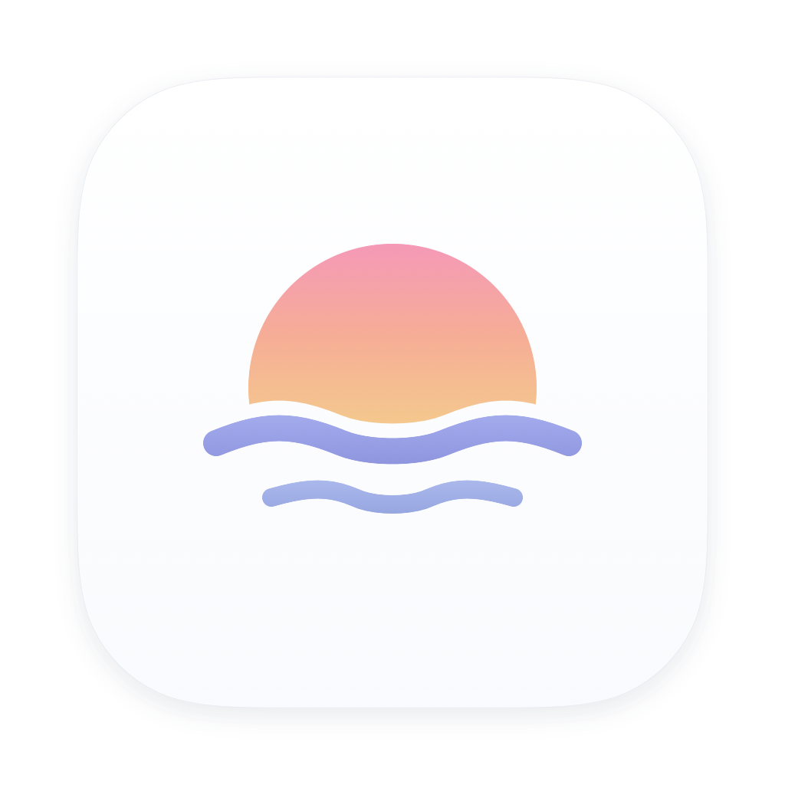
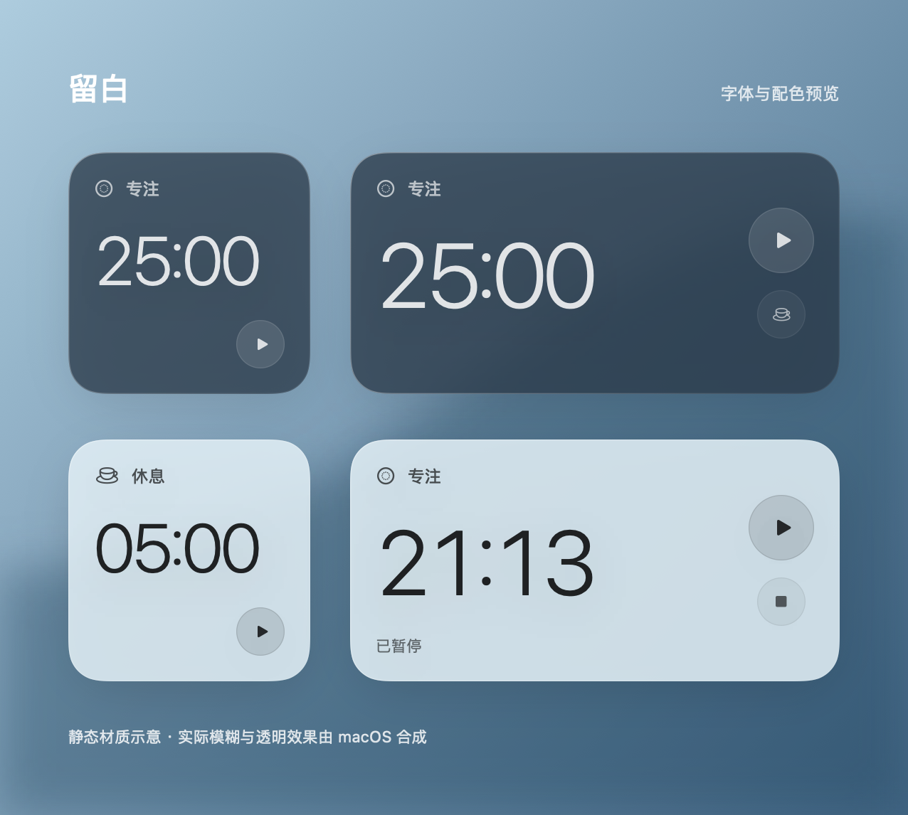

<p align="center"></p>

<h1 align="center">Afterglow · 留白</h1>

<p align="center">A quiet, native focus timer for macOS.</p>

<p align="center">
  
  
  <a href="LICENSE"></a>
  
</p>

<p align="center">
  <a href="README.md">简体中文</a> · English<br />
  <a href="#get-started">Get started</a> · <a href="docs/BUILDING.md">Desktop widgets</a> · <a href="CONTRIBUTING.md">Contribute</a>
</p>

<p align="center">
  
  <br /><sub>Layout and color study. macOS composites the actual background blur.</sub>
</p>

> **Early preview:** the native app runs locally. Both app and widget pass a full Xcode build; signed installation and on-desktop interactions still need validation.

## Why Afterglow

A focus timer should ask for little attention. Afterglow keeps time and controls up front, with history and settings available when needed.

- **At home on Mac.** SwiftUI, AppKit, system materials, SF Pro, and SF Symbols. Dark, light, and automatic appearance.
- **A few clicks.** Pick a duration and start. Press Space to pause or resume, or use the menu bar panel.
- **Offline by design.** No accounts, servers, or telemetry. Session history stays on your Mac.
- **Keeps its place.** Persisted deadlines survive sleep and relaunch. Paused time does not count as focused time.
- **Small and inspectable.** No third-party runtime dependencies. Source, build scripts, and tests live together.

## Features

| Feature | Status |
| --- | --- |
| 15 / 25 / 45-minute focus; 5 / 10 / 15-minute breaks | Available |
| Start, pause, resume, finish, and session history | Available |
| Menu bar panel and keyboard shortcuts | Implemented |
| Window materials and appearance switching | Checked on a real Mac |
| Small / medium WidgetKit widgets and App Intents | Implemented; signed installation not yet validated |

When built with Xcode 26+, app buttons use Liquid Glass on macOS 26+. Earlier toolchains or systems use Material. Reduce Transparency switches surfaces to solid colors.

## Get started

Requires macOS 14+ with Apple Command Line Tools or full Xcode. The app interface is currently in Chinese.

```sh
git clone https://github.com/zzzfu411/afterglow-macos.git
cd afterglow-macos
./scripts/build-local.sh
open .build/local/留白.app
```

This builds the app and menu bar panel only. Desktop widgets require full Xcode and a valid signing configuration. See [build instructions](docs/BUILDING.md) (Chinese, with shell commands).

| Shortcut | Action |
| --- | --- |
| `Space` | Start / pause / resume |
| `⌘ .` | Finish |
| `⌘ ,` | Settings |

Local builds are ad-hoc signed. No notarized distribution is available yet. Runtime validation has primarily used Apple Silicon.

## Development

```sh
./scripts/test.sh          # Timer transitions, restart, and concurrent storage
./scripts/check-native.sh  # SwiftUI and WidgetKit compilation
```

The core suite covers 34 assertions, including 246 transactions across six concurrent processes. [GitHub Actions](https://github.com/zzzfu411/afterglow-macos/actions/workflows/ci.yml) runs tests, native compilation, and a full Xcode build. See [QA.md](QA.md) for validation scope and remaining gaps.

```text
App/       Windows, menu bar, and settings
Widget/    WidgetKit timelines and App Intents
Shared/    Timer state, storage, and views
Tests/     State and persistence tests
```

## Next

- [ ] Validate signed widgets in the desktop gallery and widget host
- [ ] Check wallpaper, monochrome, and transparent appearances
- [ ] Prepare notarized distribution

Issues, visual feedback, and focused improvements are welcome. Read [CONTRIBUTING.md](CONTRIBUTING.md).

## License

[MIT](LICENSE). System fonts and SF Symbols are accessed through Apple frameworks; font files are not redistributed.
